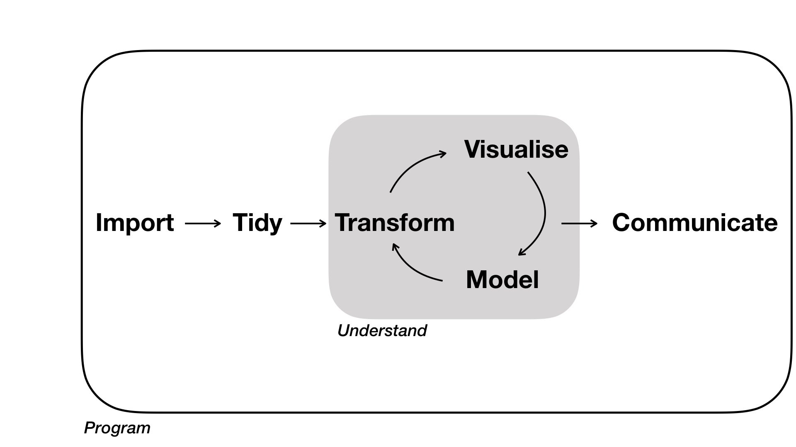
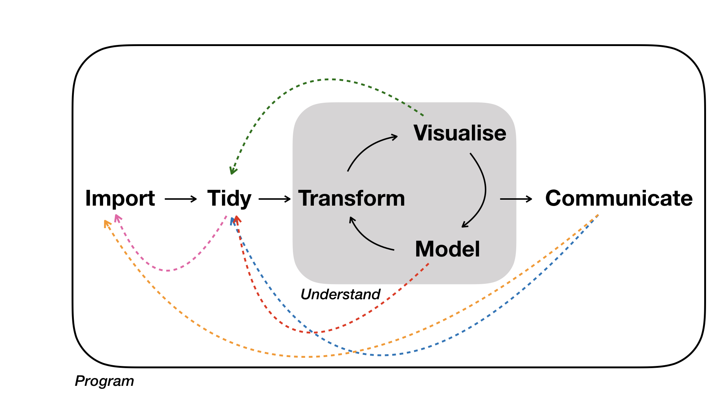

# Session 1 - Quantitative Tutorials

## Week 5 - R basics and Data Analysis workflow

Dr. Erola Fenollosa (she/her)

26/10/2021

### Introduction

The aim of these tutorials is to improve your biological data analytic skills. This first session will help us to standardize the general R programming level, and revise the concepts of the data analysis workflow (import data, data wrangling, visualization, the data life-cycle).

*Data analysis* is a term that describes the process of turning raw data into knowledge. [Grolemund & Wickham, 2017](https://r4ds.had.co.nz/workflow-basics.html) presented this as a diagram:

[](https://r4ds.had.co.nz/index.html)

But... this is not what actually happens. This figure presented by Rüeger & Allie 2019 in "[Robust data analysis: an introduction to R](https://sinarueeger.github.io/robust-data-analysis-with-r/)" is much accurate:



Data wrangling and data analysis in general is rarely a linear process. It is instead a back and forth between modules. Therefore, *flexibility* in moving between these modules with software, along with *automation* is important. This can be achieved with written programs that can be re-executed at any time (Rüeger & Allie 2019).

### 0. Prior questions

-   What's the difference between R and RStudio?

-   What does "R is a free software" mean?

-   What is an R package?

-   Where do I look for help?

-   The essence: "Computational Empathy"

### 1. Meet RStudio interface

It is assumed that you have R and RStudio installed at this point. If not, revise: <https://rstudio-education.github.io/hopr/starting.html>. Explore/adjust the different panels: Script - Console - Environment - File/Plots.

### 2. R is a calculator with enormous memory

R is basically nothing more than a calculator, but it's open-access, flexibility and the great community using it is what captivated us all.

```{r}
# The hash symbol is used to create comments
10+5
```

You can store parameters or objects with the assignation symbol:

```{r}
ten <- 10
ten
```

R is case-sensitive:

```{r}
# Ten
```

### 3. Don't get lost with the multiple formats: Rscript, Rmd, md, RData, RProject, R package

-   Do you know the differences of the different mentioned formats?

-   When would you use each?

-   Get used to R markdown files type

-   Did you know about [GitHub](https://github.com/erolafr)?

### 4. Starting hard: Import your data

It is very common to start learning R by generating data. Which ways do you know for data generation?

I prefer start directly from importing your own data.

library("readxl")

setwd("C:/Users/erola/OneDrive - Universitat de Barcelona/4_Curs2021/2005 Betalaines/BKG")

dades \<- read_excel("testmodelsPytonNONA04.xlsx")

### 5. See your data:

View(dades) summary(dades) str(dades) names(dades)

### 6. Acces your variables:

dades\$Bet

### 7. Plot your variables:

hist(dades\$Bet)

### 8. Let's plot two variables:

plot(dades$Bet ~ dades$red)

### 9. ADVANTAGES OF USING R: Automatization:

dades\<- as.data.frame(dades)

for (i in 2:length(dades)) { a \<- cor.test(dades$Bet, dades[,i]) print(paste(colnames(dades)[i], " est:", a$estimate, " p=value:", a\$p.value)) }

### 10. ANOVA

res.aov \<- aov(V \~ time*temp*medi\*imb, data = test) summary(res.aov) TukeyHSD(res.aov)

install.packages("agricolae") library(agricolae)

(HSD.test(res.aov, "medi"))

### 11. BEAUTIFUL PLOTS

<https://www.r-graph-gallery.com/>

library(ggplot2)

ggplot(dades, aes(x=Bet, y=red) ) + geom_hex(bins = 10) + scale_fill_continuous(type = "viridis") + theme_bw()

ggplot(dades, aes(x=Bet, y=red) ) + stat_density_2d(aes(fill = ..level..), geom = "polygon")

### 12. COMMON PROBLEMS

I have "NAs" --\> Use na.action() or na.rm() in your function.

POSAR COM FER COMPLETE CASES!!!!!

I have categorical variables classified as numbers--\> Transform it into a factor with as.factor()

I have a warning and I don't understand why --\> Paste the warning in google

A package is not working --\> it may be out of date? Re-install it.
