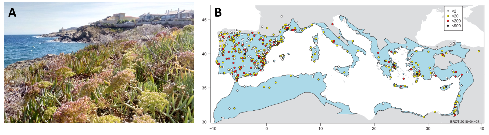

# Session 1 - Quantitative Tutorials

## Week 3 - R basics and Data Analysis workflow

Dr. Erola Fenollosa (she/her)

26/10/2021

### Introduction

The aim of these tutorials is to improve your biological data analytic
skills. This first session will help us to standardize the general R
programming level, and revise the concepts of the data analysis workflow
(import data, data wrangling, visualization, the data life-cycle).

**Data analysis** is a term that describes the process of turning raw
data into knowledge. [Grolemund & Wickham,
2017](https://r4ds.had.co.nz/workflow-basics.html) presented this as a
diagram:

[](https://r4ds.had.co.nz/index.html)

But… this is not what actually happens. This figure presented by Rüeger
& Allie 2019 in “[Robust data analysis: an introduction to
R](https://sinarueeger.github.io/robust-data-analysis-with-r/)” is much
accurate:


Data wrangling and data analysis in general is rarely a linear process.
It is instead a back and forth between modules. Therefore,
**flexibility** in moving between these modules with software, along
with *automation* is important. This can be achieved with written
programs that can be re-executed at any time (Rüeger & Allie 2019).

### 0. Prior questions

- What’s the difference between R and RStudio?

- What does “R is a free software” mean?

- What is an R package?

- Where do I look for help?

- The essence: “Computational Empathy”

### 1. Meet the RStudio interface

It is assumed that you have R and RStudio installed at this point. If
not, revise: <https://rstudio-education.github.io/hopr/starting.html>.
Explore/adjust the different panels: Script - Console - Environment -
File/Plots.

### 2. R is a calculator with enormous memory

R is basically nothing more than a calculator, but it’s **open-access**,
**flexibility** and the **huge community** using it is what captivated
us all.

``` r
# The hash symbol is used to create comments
10+5
```

    ## [1] 15

You can store parameters or objects with the assignation symbol:

``` r
ten <- 10
ten
```

    ## [1] 10

R is case-sensitive:

``` r
# Ten
```

We don’t need the “ten” object anymore, how can we remove it from our
environment to release memory?

``` r
# Find a way to remove the "ten object"

#TBC
```

R has multiple **data structures**: By increasing complexity: vector,
matrix, list, dataframe. See illustration from
[here](http://venus.ifca.unican.es/Rintro/dataStruct.html):


### 3. Don’t get lost with the multiple formats: Rscript, Rmd, md, RData, RProject, R package

- Do you know the **differences** of the different mentioned formats?

- **When** would you use each?

- Get used to **R markdown files** type

- Did you know about **[GitHub](https://github.com/erolafr)**?

### 4. Starting hard: Import your data

It is very common to start learning R by generating data. Which ways do
you know for data generation? I prefer start directly from importing
your own data. There are several ways to do it. Could you find one?

**Import here the csv and and Excel dataset** that you’ll find in the
Session1/data github folder. Did you need any additional packages?

``` r
# Import a CSV: BROT2_dat.csv
# TBC

# Import an Excel file: BROT_SeedMassGrowthForm.xlsx
# TBC
```

The BROT 2.0 dataset from Tavşanoğlu and Pausas 2018 can be found
[here](https://figshare.com/collections/BROT_2_0_A_functional_trait_database_for_Mediterranean_Basin_plants/3843841),
BROT is a database of pant functional traits for the Mediterranean Basin
flora. It includes 25764 records of 44 traits from 2457 plant taxa
distributed in 119 taxonomic families. Find [here the
publication](https://www.nature.com/articles/sdata2018135). The Excel
file is a processed subset of this database with the values of seedMass
and growth form for all species in BROT 2.0. In the following image you
can see a picture I toke near Cap de Creus at the mediterranean Basin
(A), and the Geographical scope of the database in the Mediterranean
Basin, extracted from Figure 2 in [Tavşanoğlu and Pausas
2018](https://www.nature.com/articles/sdata2018135).



### 5. Take a look to the data

Play on your own with the data you’ve imported. Test the **following
functions** and write down what do they do:

``` r
#View()
# TBC
```

``` r
#summary()
# TBC
```

``` r
#names()
# TBC
```

``` r
#str()
# TBC
```

``` r
#head()
# TBC
```

Explore the data, find the dataset lenght and the minimum and maximum of
a variable.

``` r
# TBC
```

### 6. Access your variables:

There are multiple ways to **access the variables of a dataset**.
Generally by index or by name. Remember R indexes from 1 (Python indexes
from 0).

``` r
# datasetName$datasetVariable
# TBC
```

``` r
#datasetName[,VariablePosition]
# TBC
```

### 7. Plot your variables:

Prepare a **plot of a variable**, you can choose an histogram, boxplot,
barplot, scatterplot, etc. Choose a plot and try to make it here:

``` r
#TBC
```

Creating a **good visualization is an art**. You can see some examples
here: <https://www.r-graph-gallery.com/>

### 8. Common problems

- Missing data. What is missing data? It depends on the experiment.
  Usually labeled as “NAs” –\> Use na.action() or na.rm(). Very common
  for certain analysis: df \<- df\[complete.cases(df), \]

- I have categorical variables classified as numbers–\> Transform it
  into a factor with as.factor(). Check always your variable type with
  str().

- I have a warning and I don’t understand why –\> Paste the warning in
  google

- A package is not working –\> Is it activated (library)? It may be out
  of date? Re-install it.

### 9. Your Data Science project

To learn while working on a real data science problem I purpose here
that you **find a dataset** that you have a particular interest on and
use it for the upcoming sessions. This will help us find real problems
that need to be solved with diverse data science tools. Data is more
available than ever. You can both create a dataset of your own (it must
include at least 50 observations and five categorical and/or numerical
variables) or choose a public dataset online. Here you can find some
dataset repositories:

- Kaggle: <https://www.kaggle.com/datasets>

- UCI: <https://archive.ics.uci.edu/ml/index.php>

- UK Open Data:
  <https://www.data.gov.uk/search?filters%5Btopic%5D=Environment>

- Data.world: <https://data.world/datasets/environment>

Choose a dataset, download it and **for the next session**:

- 1.  Write a RScript to import the dataset

- 2.  Identify a numerical and a categorical variables from your
      dataset.
